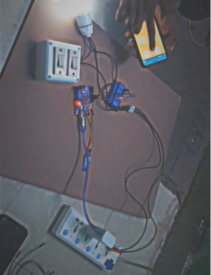

# 🏠 Automation of Home Appliances Using Arduino & Bluetooth

A smart home automation system built using **Arduino Uno**, **HC-05 Bluetooth Module**, and a **2-Channel Relay Module**. The system enables users to wirelessly control household appliances such as lights and fans through an Android smartphone using Bluetooth communication.

---

## 📖 Project Overview

This project provides a low-cost and user-friendly home automation solution. Instead of using traditional wall switches or dedicated remote controls, users can control electrical appliances directly from their smartphone within Bluetooth range.

The Arduino Uno receives commands from the HC-05 Bluetooth module and controls the connected appliances through relay modules.

---

## ✨ Features

- 📱 Wireless appliance control using an Android smartphone
- 🔵 Bluetooth communication (HC-05)
- 💡 Control lights, fans, and other electrical devices
- ⚡ Low-cost and easy-to-build design
- 🔌 Expandable to control multiple appliances
- 🛠 Beginner-friendly Arduino project

---

## 🛠 Hardware Components

- Arduino Uno
- HC-05 Bluetooth Module
- 2-Channel Relay Module
- 5V Power Supply
- Connecting Wires
- AC Bulb / Fan (Load)
- Android Smartphone

---

## 💻 Software Requirements

- Arduino IDE
- Bluetooth Terminal / Bluetooth Controller App
- Arduino C++

---

## ⚙️ Working

1. Pair the Android phone with the HC-05 Bluetooth module.
2. Open a Bluetooth Controller application.
3. Send control commands.
4. Arduino receives the commands through serial communication.
5. Relay module switches the appliances ON or OFF.

---

## 📲 Bluetooth Commands

| Command | Action |
|---------|--------|
| 1 | Turn ON Appliance 1 |
| 2 | Turn OFF Appliance 1 |
| 3 | Turn ON Appliance 2 |
| 4 | Turn OFF Appliance 2 |

---

## 📂 Repository Structure

```
AUTOMATION-OF-HOME-APPLIANCES/
│
├── HomeAutomation.ino
├── HOME_AUTOMATION.pdf
├── README.md
└── HOME_AUTOMATION.png
```

---

## 🚀 Future Improvements

- Wi-Fi based home automation using ESP8266/ESP32
- Voice control using Google Assistant or Alexa
- IoT monitoring through a mobile application
- Timer and scheduling features
- Energy consumption monitoring

---

## 📷 Project Screenshot

> Add your circuit diagram or project image below.



---

## 👨‍💻 Author

**Charan**

Electronics & Communication Engineering Student

- GitHub: https://github.com/Charan140205

---

## 📜 License

This project is developed for educational and learning purposes.
